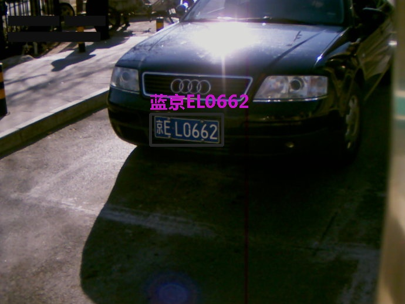
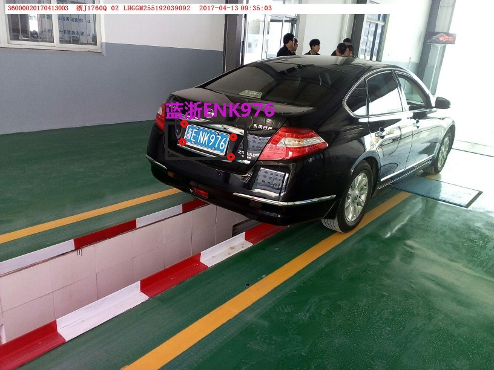
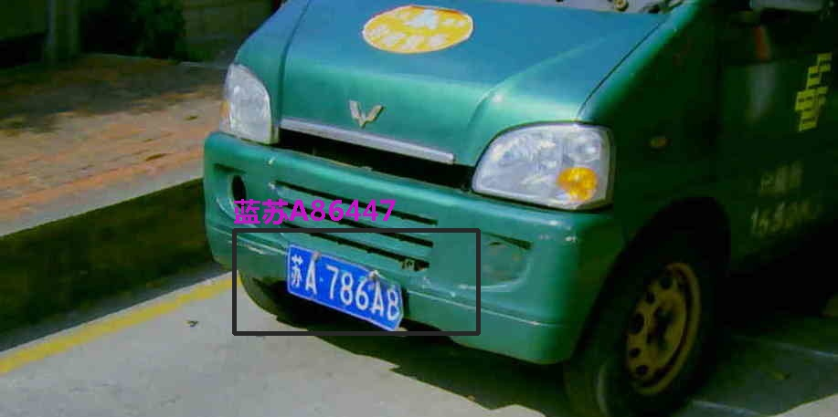
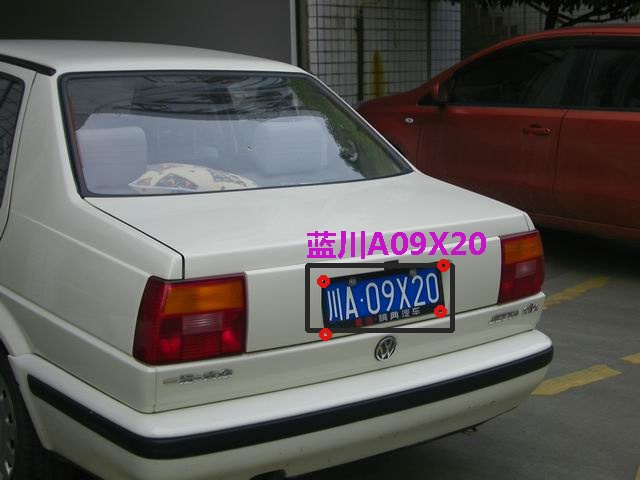
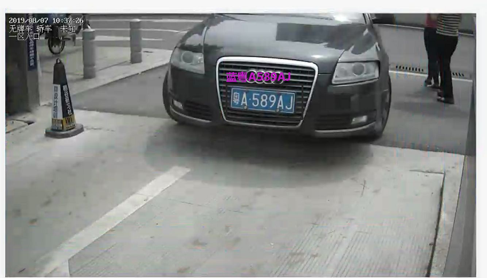
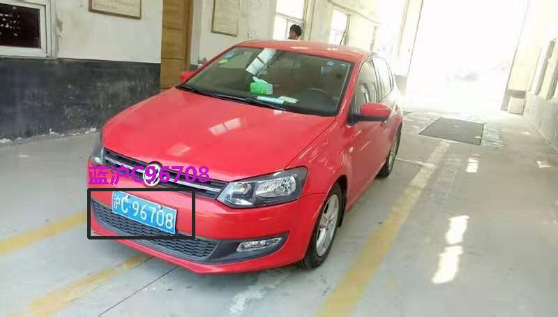
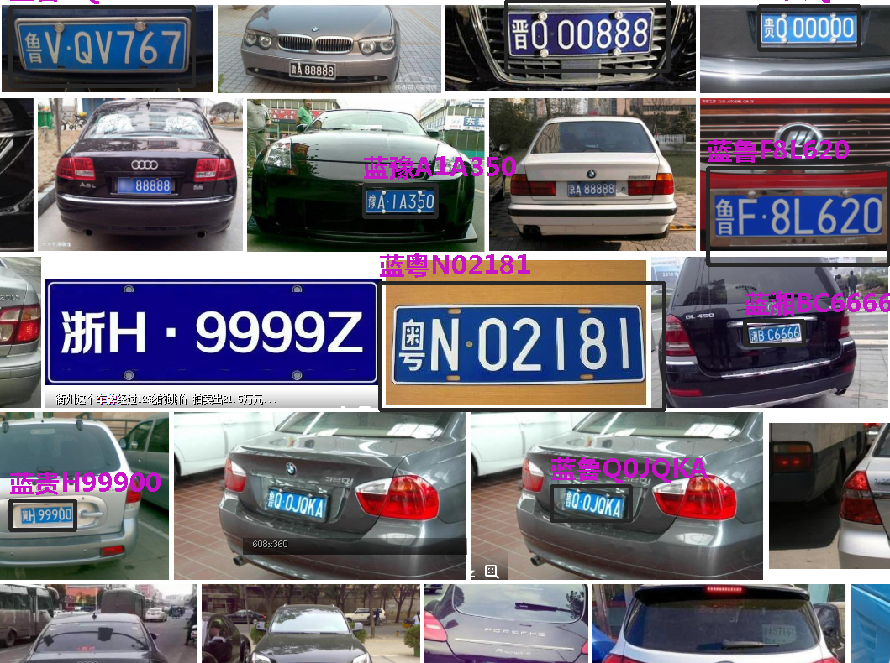

# ---- 2019-08-13 支持黄牌识别的模型和车牌颜色识别的模型放出 ------
Light-LPR是一个瞄准可以在嵌入式设备、手机端和普通的x86平台上运行的车牌识别开源项目，旨在支持各种场景的车牌识别,车牌字符识别准确率超99.95%，综合识别准确率超过99%，支持目前国内所有的车牌识别，觉得好用的一定要加星哦。 
技术上采用MTCNN检测车牌和四个角点精确定位，并进行偏斜纠正，最后进行端到端识别车牌号码，使用MNN作为推理引擎。具有结构简单，灵活部署的特点，适应各类计算平台。
部分识别效果展示

# 支持的中华人民共和国大陆车牌

| 车牌种类 | 开源版 | 专业版 | 商业版 |
| --------: | :-----: | :----: |  :----: |
| 蓝   |  Y |  Y | Y |
| 黄   |  Y |  Y | Y |
| 新能源   |  - |  Y | Y |
| 大型新能源   |  - |  Y | Y |
| 教练车牌   |  - |  Y | Y |
| 双层黄牌| - | Y | Y |
| 摩托车牌 | - | Y | Y |
| 警牌   |  - |  - | Y|
| 军牌   |  - |  - | Y|
| 双层军牌   |  - |  - |Y |
| 武警车牌   |  - |  - | Y|
| 双层武警牌照   |  - |  - | Y|
| 港澳通行牌 | - | - | Y | 
| 普通黑牌 | - | - | Y |
| 应急车牌 | - | - | Y |
| 民航车牌 | - | - | E |
| 使、领馆车牌 | - | - | Y |
| 低速农用车牌 | - | - | - |
| 临牌 | - | - | E |

备注： Y 支持，- 不支持，E 处于评估阶段

# 支持的中华人民共和国台湾车牌
| 车牌种类 | 开源版 | 专业版 | 商业版 |
| --------: | :-----: | :----: |  :----: |
| 白 |  - |  E | E |
| 黑 |  - |  E | E |

# 1080P图片识别基准性能

| 平台      | CPU型号    |  内存  | 开源版平均识别时间(ms)   | 专业和商业版平均识别时间(ms) |
| :-------- | :-----    | :----:  | ----:  | ----:  |
| X86  | i5-8265   |  8G    | 451 | <50  |
| ARM  | A53       | 1G    | 1532| <160 |
| Huwei P20 pro| ... | 4G | - |  <100 |

#安装依赖
cmake >= 3.10.0
opencv >= 3.0.0
openmp

# x86平台Linux安装指令
<pre>
git clone https://github.com/lqian/light-LPR
cd light-LPR && mkdir build && cd build
cmake ../
make
</pre>

# ARM平台Linux安装指令
<pre>
git clone https://github.com/lqian/light-LPR
cd light-LPR && mkdir build && cd build
cmake ../ -DLIGHT_LPR_ARCH=arm
make
</pre>

# Windows平台上安装指令
- 下载cmake 3.10以上版本并安装
- 首先下载Visual Studio 2017或者 Native Builder Tool for Visual Studio 2017，安装c++编译工具
- 如果编译64位系统，下载64位[opencv-3.4.2-install-win64.zip](https://pan.baidu.com/s/1CtabojjfEK-bK_XwfG9HTA), 32位系统则下载[opencv-3.4.2-install-win32.zip](https://pan.baidu.com/s/1E7zhRsrrpc9JEhB_6gpehg)，解压到任意目录
- 克隆[MNN](https://github.com/alibaba/MNN)的源码
- 下载[flatc_windows_exe.zip](https://github.com/google/flatbuffers/releases/download/v1.11.0/flatc_windows_exe.zip)，把flatc.exe可执行文件复制到{MNN}/3rd_party/flatbuffers/tmp目录下
- 以管理员权限打开powershell.exe，然后执行set-executionpolicy -executionpolicy unrestricted，提示选Y
- 注释掉MNN的源码目录中的CMakelist.txt中的`COMMAND powershell ${CMAKE_CURRENT_SOURCE_DIR}/schema/generate.ps1 -lazy`这行，大约在461行
<pre>
> cd MNN
> schema\enerate.ps1
> mkdir build 
> cd build
按win键，根据需要，搜索x86 builder tool或者x64 builder tool
> cmake -G "NMake Makefiles" -DCMAKE_BUILD_TYPE=Release ../
> nmake 
把编译成功的MNN.dll、MNN.lib文件复制到light-LPR项目的lib目录下
> cd light-LPR && mkdir build && cd build
> set OpenCV_DIR=/path/to/opencv-install/directory
> cmake -G "NMake Makefiles" ..
> nmake
</pre>

# 运行测试
`./examples/demo ../models/ [/path/to/a/image]`
本项目在Fedora 29，CentOS 7.6, Windows 10 64位家庭版，Ubuntu 18.04 mate for ARM平台测试通过

# 参考和引用
- [Alibaba MNN](https://github.com/alibaba/MNN)
- [License-Plate-Detect-Recognition-via-Deep-Neural-Networks-accuracy-up-to-99.9](https://github.com/zhubenfu/License-Plate-Detect-Recognition-via-Deep-Neural-Networks-accuracy-up-to-99.9)
- [Caffe_OCR](https://github.com/senlinuc/caffe_ocr)
- [MNN MTCNN CPU OPENCL](https://github.com/liushuan/MNN-MTCNN-CPU-OPENCL)

# License
Apache 2.0

# 其他
- 技术交流、数据交流和捐赠请联系作者或加QQ群，图像处理分析机器视觉 109128646[已满], light-LPR群号：813505078
-  
